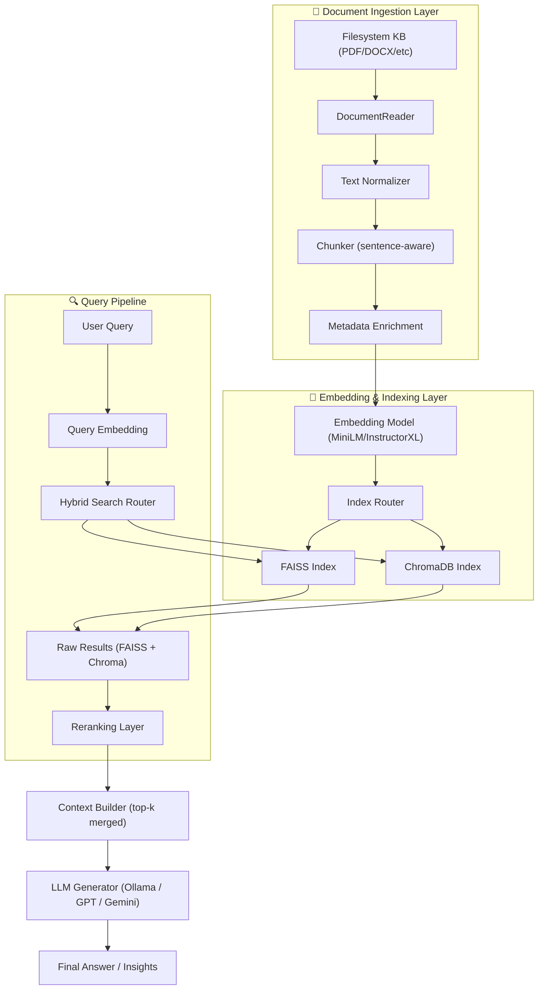

# 🏥 Nursing AI Platform – Enterprise Technical Overview

The **Nursing AI Platform** is an enterprise‑grade Retrieval‑Augmented Generation (RAG) solution designed for clinical training, knowledge retrieval, competency assessment, and AI‑enhanced decision support.  
The platform integrates a multi‑index vector search engine, a structured medical Knowledge Base, a secure audit subsystem, a monitoring framework, and automated NHS band‑aligned question‑generation pipelines.

This document provides a full enterprise‑level technical overview suitable for clinical organisations, healthcare AI integrators, and research environments.

---

# 📐 1. System Architecture Overview

The Nursing AI Platform is structured around several core pillars:

- **Document Ingestion & Processing**
- **Semantic Embedding & Vector Indexing (RAG)**
- **Context Assembly & LLM Inference**
- **Governance Layer (Audit, Compliance, Monitoring)**
- **Automated Question Bank Engine (Bands 2–8)**
- **Knowledge Base Service**
- **Knowledge Graph Visualisation**
- **Evaluation & Scoring Engine**

All subsystems are modular and independently deployable.

---

# 🔍 2. RAG Pipeline Architecture

Below is the full RAG pipeline diagram (Mermaid‑compatible for GitHub):



---

# 📘 3. RAG Pipeline – Enterprise Explanation

## 3.1 Document Ingestion Layer  
- Multi‑format ingest (PDF, DOCX, TXT, HTML, PPTX, CSV, etc.)  
- Content cleaning & normalisation  
- Sentence‑aware chunking  
- Metadata enrichment (speciality, band, topic, source)  

---

## 3.2 Embedding & Indexing Layer  
- Semantic encoders (MiniLM / InstructorXL)  
- Multi‑index routing (general, speciality, band-specific)  
- FAISS for high‑performance vector search  
- ChromaDB for persistent vector storage  
- Hybrid search and fallback mechanisms  

---

## 3.3 Query Pipeline  
- Query embedding  
- Multi‑index hybrid retrieval  
- Raw result merging  
- Reranking for clinical relevance  
- Full audit traceability  

---

## 3.4 Context Assembly & LLM Inference  
- Top‑k merging  
- Context filtering  
- LLM inference via Ollama, GPT, Gemini  
- Produces clinically grounded answers  

---

# 🏗️ 4. System Components

## 4.1 Knowledge Base Service
- Loads documents by speciality & band  
- Manages metadata, indexing state, and lineage  
- Provides structured retrieval APIs  

## 4.2 RAG Services
- `rag_service.py` – FAISS-based retrieval  
- `rag_engine.py` – ChromaDB retrieval  
- Dual-engine architecture ensures resilience  

## 4.3 Audit Logging (Tamper‑Evident Chain)
- SHA‑256 cryptographic chaining  
- Forensic-grade audit trails  
- Supports GDPR, NHS DSP, and ISO 27001 compliance  

## 4.4 Monitoring & Observability
- CPU, RAM, disk, DB latency, Redis status  
- Grafana/Kibana-compatible metrics  
- SLA and health reporting  

## 4.5 Automated Question Bank Generator
- Creates **1,890 nursing question banks**  
- NHS Bands 2–8, 9 specialities, 30 banks each  
- Covers clinical assessment, calculations, leadership, supervision, and safety  

---

# 🔒 5. Security & Compliance Layer

## Authentication & Authorization
- JWT-based authentication  
- MFA support  
- RBAC enforcement  

## Audit Chain
- Immutable, tamper-evident logging  
- Full action provenance  

## Data Protection
- Sanitisation & validation  
- Optional encryption at rest  
- GDPR/HIPAA/ISO‑compatible  

---

# ⚙️ 6. Deployment & Scaling

## Supported Environments
- On-premise hospital infrastructure  
- NHS‑approved cloud vendors  
- Hybrid deployments  

## Scalability Model
- Stateless API layer (autoscalable)  
- Asynchronous indexing  
- Decoupled vector search  
- Horizontal scaling architecture  

---

# 🧪 7. Testing & QA

- Full pytest integration  
- Security test hooks (ZAP/Burp-ready)  
- Automated question bank validation  
- Audit chain integrity checks  

---

# 🛠️ 8. Installation Overview

### Clone repository
```bash
git clone https://github.com/your-org/nursing-ai
cd nursing-ai
```

### Install backend
```bash
pip install -r requirements.txt
```

### Build FAISS indexes
```bash
python scripts/build_rag_index.py
```

### Run backend
```bash
uvicorn main:app --host 0.0.0.0 --port 8000
```

### Run frontend
```bash
cd frontend
npm install
npm start
```

---

# 📁 9. Project Structure

```
.
├── core/
├── services/
├── utils/
├── scripts/
├── frontend/
└── README.md
```

---

# 🤝 10. Contribution Guidelines

We welcome contributions from clinical, engineering, and data science teams.

1. Fork the repository  
2. Create a feature branch  
3. Commit changes with documentation  
4. Submit a pull request  

---

# 📄 11. License

Released under the **MIT License**.  
Enterprise licensing available on request.

---

# 📬 12. Contact

For inquiries, collaborations, or enterprise deployment discussions, please contact:

📧 **eugdum3@gmail.com**

---
